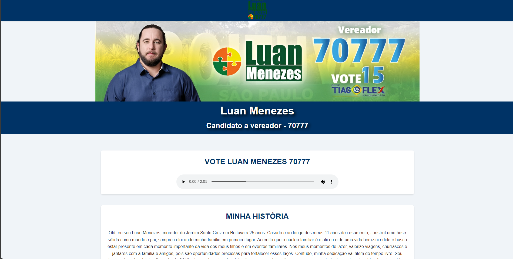

# Site de Campanha para Candidato a Vereador

Este projeto é um site de campanha para um candidato a vereador, desenvolvido para fornecer informações sobre o candidato, suas propostas e permitir que os eleitores interajam com o conteúdo, como ouvir o jingle da campanha e baixar materiais informativos.

Site esse feito como uma forma de trabalho voluntário para que eu possa colocar em prática algumas coisas que eu aprendi e estou aprendendo.

## Índice
- [Visão Geral](#visao-geral)
- [Recursos](#recursos)
- [Tecnologias Utilizadas](#tecnologias-utilizadas)

## Visão Geral

Este site foi desenvolvido com o objetivo de ser uma plataforma informativa e direta para apoiar a campanha do candidato a vereador. Ele é responsivo e possui uma interface amigável, buscando atender à população de Boituva com informações claras sobre o candidato.

## Recursos
<ul>
  <li><strong>Página Inicial</strong>: Contém o banner do candidato e um resumo de sua mensagem.</li>
  <li><strong>Sobre o Candidato</strong>: Uma seção dedicada a contar a história do candidato.</li>
  <li><strong>Propostas</strong>: Exibe as propostas de campanha, com opção para baixar o documento completo.</li>
  <li><strong>Jingle</strong>: Possibilidade de ouvir o jingle da campanha diretamente no site.</li>
  <li><strong>Contato</strong>: Formulário de contato para envio de mensagens.</li>
</ul>

## Tecnologias Utilizadas
<ul>
  <li><strong>HTML5 e CSS3</strong>: Para estrutura e estilos das páginas.</li>
  <li><strong>JavaScript</strong>: Para a criação de interações.</li>
  <li><strong>PHP (opcional)</strong>: Para manipulação de formulários e envio de mensagens.</li>
  <li><strong>Git/GitHub</strong>: Controle de versão e repositório do projeto.</li>
</ul>
